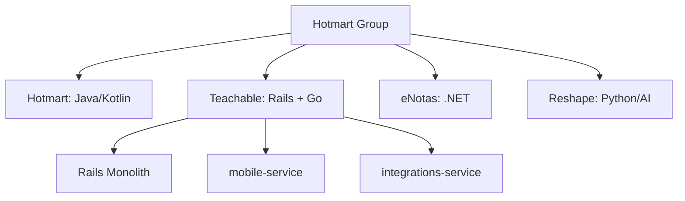
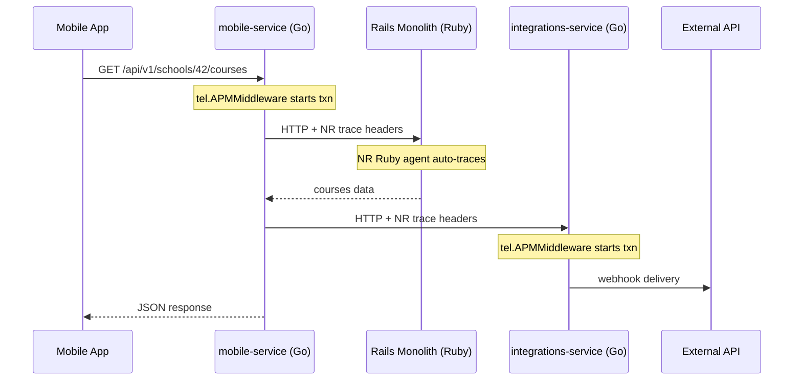

# Architecting Observability in Go

Context Propagation, Structured Logging, and Telemetry Strategy
<div class="pt-2">
  <span class="opacity-60">
    Gilmar Alcantara - Hotmart
  </span>
</div>


<!--
- Personal challenge
- to reach more people.
-->

---

# About Me

<div class="grid grid-cols-2 gap-8 mt-6">
<div>

**Gilmar Alcantara**

- 💼 *+10 years* of software engineering experience
- 🏢 Staff Engineer at **Hotmart**
- 🎓 Bachelor of Computer Engineering from **CEFET-MG**

</div>
<div>

- 🌎 Based in Brazil (Minas Gerais)
- 👨‍👦 Father of **Benjamin** (9 years) and **Levi** (2 months)
- 🌍 Now working with **international financial regulations** at Hotmart


</div>
</div>


<!--
- graduated
-->

---

# About This Talk

Based on a **real-world experience** leading an observability migration at **Hotmart** - a global edtech company that also operates **Teachable**.

<v-clicks>

- **Datadog → New Relic migration** driven by cost reduction (free data quota on NR contract)
- Led the **Go microservices** instrumentation strategy under a tight deadline
- Collaborated on **Ruby and Java** service instrumentation
- Not a vendor comparison - **architectural learnings** and practical decisions
- **Observability is an architectural decision, and in Go, it is explicit by design.**


</v-clicks>

<!--
-
-->

---
layout: section
---

# The Migration Context

---

# The Landscape



<v-clicks>

- **Hotmart** acquired **Teachable** in 2021
- Hotmart was already using **New Relic** (Java/Kotlin)
- Teachable was on **Datadog** - Rails monolith + Go microservices
- The migration happened only on **Teachable's side** (Ruby + Go)

</v-clicks>

<!--
-
-->

---

# Why the Migration Was Hard

<v-clicks>

- **Tight deadline** 
    - the Datadog contract was expiring. We had weeks, not months
- **Different runtimes, different models**
    - auto-agent Ruby vs manual (Go)
- **No standard for instrumentation across Go services** 
    - different HTTP handlers, different logging libraries

</v-clicks>

<v-click>

> The deadline is also why we didn't go straight to OpenTelemetry. The vendor SDK was the fastest path to production with quality - and the New Relic team supported us directly along the way. OTel is the strategic direction - just not under this deadline.

</v-click>

<!--
- To be pragmatic.
- Keep this simple
-->

---
layout: section
---

# The Problem We're Solving

Logs, metrics, and traces - and why they're useless apart

---

# The Three Pillars

<v-clicks>

- **Logs** - what happened
    - Detailed event records with business context at each step
- **Metrics** - how much, how often
    - Aggregated numbers: request count, error rate, latency percentiles
- **Traces** - where the time went
    - The path of a request across services, with latency at each hop

</v-clicks>

<v-clicks>
<div class="mt-8 p-3 bg-blue-50 rounded dark:bg-blue-900">
💡 Cost: Logs vs Metrics
</div>
<div class="mt-8 p-3 bg-blue-50 rounded dark:bg-blue-900">
💡 Three views of the same request - but isolated.
</div>
</v-clicks>

<!--
-- Examples to base alerts on Metrics instead of Logs
-- Logs sampling
-- Cost Logs vs Metrics
-->

---

# The Real Problem: Correlation

<v-clicks>

- You have an **error** in your logs.
- You have a **latency spike** in your metrics.
- You have a **slow span** in your traces.

</v-clicks>


<v-click>

<div class="mt-6 text-2xl font-bold">
How do you know they belong to the <span class="text-blue-400">same request</span>?
</div>

</v-click>

<v-click>
<div class="mt-4 p-3 bg-blue-50 rounded dark:bg-blue-900">
💡 The <strong>trace_id</strong> is the thread that <strong>connects</strong> the three pillars
</div>
</v-click>

<v-click>
<div class="mt-4 p-3 bg-blue-50 rounded dark:bg-blue-900">
💡 Jump from a metric alert → the trace → the exact log line.
</div>
</v-click>

<!--
- Last thing – Logs
-->

---
layout: section
---

# Why Observability in Go is Different

---
layout: two-cols
---

# Automatic vs Manual Instrumentation

**JIT/Interpreted Languages** (Java, Ruby, Node.js)

<v-clicks>

- Runtime agents intercept calls
- Automatic span creation
- Low initial effort
- **Less control, more noise**

</v-clicks>

::right::

<div class="mt-22">

**Go (Compiled)**

<v-clicks>

- Explicit instrumentation in code
- Developer decides span boundaries
- Higher initial effort
- **Full control, clean signals**

</v-clicks>

</div>

<v-click>

<div class="mt-4 p-3 bg-blue-50 rounded dark:bg-blue-900">
💡 More upfront work, but <strong>significantly better signal-to-noise ratio</strong>.
</div>

</v-click>

<v-click>

<div class="ctx-banner">
In Go, <code>context.Context</code> carries the <strong>trace_id</strong> that correlates the pillars.
</div>

</v-click>

<!--
- Reflection 
- Java aspects!
- Teams Seniority
- The conclusion of this slide: Go is explicit, so context.Context is THE mechanism for correlation.
-->

---
layout: section
---

# Context Propagation

The backbone of distributed tracing in Go

---

# context.Context: The Propagation Vehicle

```go {all|3-4|6|8-11|all}
// mobile-service - handler with context propagation
func GetCourses(cfg config.Configs, logger log.Loggable, client tel.HttpClient) http.HandlerFunc {
    return func(w http.ResponseWriter, r *http.Request) {
        ctx := r.Context()
        schoolID := r.PathValue("school_id")
        courses, err := fetchCourses(ctx, client, cfg, schoolID)
        if err != nil {
            logger.ErrorContext(ctx, "failed to fetch courses",
                "school_id", schoolID,
                "error", err,
            )
            http.Error(w, "internal error", http.StatusInternalServerError)
            return
        }
        writeJSON(w, courses)
    }
}
```

<v-click>

<div class="mt-4 p-3 bg-blue-50 rounded dark:bg-blue-900">
💡 <code>context.Context</code> is an <strong>immutable tree</strong>: each <code>WithValue</code> / <code>WithCancel</code> returns a new child node wrapping its parent - never mutated, only derived.
</div>

</v-click>

<!--
- What is context!
- Layer Architecture

 context.Context is Go's standard type for carrying request-scoped values, deadlines, and cancellation across API boundaries - passed as the first argument, from the entry point all the way down.
-->

---

# The Golden Rule of Context in Go

<v-clicks>

1. **Use `context.Background()` only at entry points** (main, init, tests)
2. **Always accept `context.Context` as the first parameter**
3. **Always propagate it downstream** - never discard
4. **Never store context in structs** - it's request-scoped

</v-clicks>

<v-click>

```go
// ✅ Correct - context flows naturally
func (r *Repo) GetUser(ctx context.Context, id string) (*User, error)

// ❌ Wrong - context stored in struct, loses request scope
type Repo struct {
    ctx context.Context  // DON'T DO THIS
}
```

</v-click>

<!--
- 2 Example about beginners in the Language that ignores Context Lib and need to refact later.
-  With Context prefix Libs
-->

---
layout: section
---

# Structured Logging with Trace Correlation

---

# From Printf to slog with Trace ID

````md magic-move
```go
// ❌ Unstructured
log.Printf("order %s processed for user %s", orderID, userID)

// Output: plain text - can't query or correlate
// order 1234 processed for user 42
```
```go
// ⚠️ Structured, but no trace correlation (json handler!)
slog.Info("order processed",
    "order_id", orderID,
    "user_id", userID,
)

// Output: JSON - queryable, but an isolated event
// {
//   "level": "INFO",
//   "msg": "order processed",
//   "order_id": "1234",
//   "user_id": "42"
// }
```
```go
// ✅ Structured + trace-correlated via context
slog.InfoContext(ctx, "order processed",
    "order_id", orderID,
    "user_id", userID,
)

// Output: JSON + trace - now correlated
// {
//   "level": "INFO",
//   "msg": "order processed",
//   "order_id": "1234",
//   "user_id": "42",
//   "trace_id": "4bf92f3577b34da6...",
//   "span_id": "00f067aa0ba902b7"
// }
```
````

<v-click>

<div class="mt-2 p-2 bg-blue-50 rounded dark:bg-blue-900 text-sm">
💡 <code>trace_id</code> and <code>span_id</code> are injected automatically by the log middleware - <strong>zero effort at call sites</strong>.
</div>

</v-click>

<!--
slog is standard since Go 1.2
-->

---

# Wiring It Up - Where the Middleware Lives

The **setup** is simple: wrap your routes. We'll see how it works next.

```go {all|3-5|9-13|all}
func main() {
    mux := http.NewServeMux()
    // Public - no instrumentation needed
    mux.HandleFunc("GET /__healthcheck__", controllers.Health)

    // Protected - wrap with observability middlewares
    handler := controllers.GetCourses(cfg, logger, httpClient)
    mux.Handle("GET /api/v1/schools/{school_id}/courses",
        tel.APMMiddleware(          // 1. starts NR transaction
        tlog.Middleware(            // 2. structured logging + trace correlation
        auth.Middleware(            // 3. authentication
            handler,
        ))),
    )
}
```

<v-click>

<div class="mt-4 p-3 bg-blue-50 rounded dark:bg-blue-900">
💡 <strong>Order matters</strong> - APM first, so the transaction exists in context when the log middleware reads it. Health checks stay outside: no need to trace or log them.
</div>

</v-click>

<!--
- http mux since: Go 1.22
- Middleware Order matters
- Manual and intencional instrumentation
-->

---

# How log Middleware Works

```go {all|5-7|9-15|16|all}
// Extracts NR trace info (added by APM Middleware) and injects into slog context
func Middleware(cfg config.Config) func(next http.Handler) http.Handler {
    return func(next http.Handler) http.Handler {
        return http.HandlerFunc(func(w http.ResponseWriter, r *http.Request) {            
            // Extract trace_id and span_id from NR transaction
            ctx := r.Context() // already has NR transaction (from APM Middleware)
            traceID, spanID := tel.TraceFromContext(ctx)

            // Inject into slog context for all downstream logs
            ctx = contextWithFields(ctx,
                slog.String("trace_id", traceID), // to be agnostic!
                slog.String("span_id", spanID), // to be agnostic!
                slog.String("http.method", r.Method),
                slog.String("http.path", r.URL.Path),
            )
            next.ServeHTTP(w, r.WithContext(ctx))
        })
    }
}
```

<v-click>

<div class="mt-4 p-3 bg-blue-50 rounded dark:bg-blue-900">
💡 The APM Middleware already adds trace_id/span_id to context. Here we're just <strong>reading</strong> them and adding extra context (method, path) for structured logging.
</div>

</v-click>

<!--
-
-->

---

# Inside Initialize - Enforcing the Standard

The **setup**: one call in `main` wires the logger. Next we'll see the handler that does the work.

```go {all|3-7|8|9-10|11|12-14|all}
func Setup(cfg config.Config) (*slog.Logger, error) {
    // ...
    fixedAttributes := []slog.Attr{
        slog.String("app_name", cfg.ServiceName),
        slog.String("app_version", cfg.Version),
        slog.String("env", cfg.AppEnv),
    }
    var appHandler *appLoggerHandler
    // NR agent available → JSON + trace correlation
    nrHandler := nrslog.JSONHandler(telemetry.App, cfg.LogOutput, &options)
    appHandler = NewHandler(nrHandler, fixedAttributes...)
    logger := slog.New(appHandler)
    slog.SetDefault(logger) // Third-party code also gets the standard
    return logger, nil
}
```

<v-click>

<div class="mt-4 p-3 bg-blue-50 rounded dark:bg-blue-900">
💡 Call <code>Setup()</code> once in <code>main</code> - every log now carries <code>app_name</code>, <code>env</code>, and trace correlation.
</div>

</v-click>

<!--
-
-->

---

# Custom slog Handler - Extracting Context

And here's the **implementation** - the `NewHandler` from `Setup` above.

```go {all|7-11}
func NewHandler(handler slog.Handler, attrs ...slog.Attr) *appLoggerHandler {
    return &appLoggerHandler{handler, attrs}
}
func (h appLoggerHandler) Handle(ctx context.Context, r slog.Record) error {
    // Fixed attributes (app_name, env, pod_name)
    r.AddAttrs(h.fixedAttributes...)
    // Trace correlation from NR transaction
    if info, ok := telemetry.TraceFromContext(ctx); ok {
        r.Add(slog.String("trace.id", info.TraceId))
        r.Add(slog.String("span.id", info.SpanId))
    }
    // HTTP request info, account, custom fields from context...
    return h.Handler.Handle(ctx, r)
}
```

<v-clicks>

- The custom handler bridges `context` and `slog`
- Every `logger.InfoContext(ctx, ...)` call automatically includes `trace_id`, `span_id`, and all enriched fields
- The caller doesn't need to pass them explicitly - the handler does the rest

</v-clicks>

<!--
-
-->

---

# Correlated JSON Output

```json {all|6-7|8-10|11-12|all}
{
  "time": "2025-03-15T10:23:45.123Z",
  "level": "INFO",
  "msg": "courses fetched",
  "service": "mobile-service",
  "trace_id": "4bf92f3577b34da6a3ce929d0e0e4736",
  "span_id": "00f067aa0ba902b7",
  "school_id": "42",
  "http.method": "GET",
  "http.path": "/api/v1/schools/42/courses",
  "mobile.device_os": "iOS",
  "mobile.app_version": "3.2.1",
}
```

<v-click>

**Jump from log → trace** in New Relic. Filter by trace_id for full request lifecycle. Correlate mobile device context with backend errors.

</v-click>

<!--
The additionalLogHeaderData injects mobile context - invaluable for debugging by device.
-->

---

# Logger in Context vs Values in Context

<div class="grid grid-cols-2 gap-4 text-sm">
<div>

**❌ Logger in context** (zerolog, logrus)

```go
func Middleware(next http.Handler) http.Handler {
  return http.HandlerFunc(func(w, r) {
    logger := zerolog.Ctx(r.Context()).With().
      Str("trace_id", traceID).
      Str("http.method", r.Method).Logger()
    ctx := logger.WithContext(r.Context())
    next.ServeHTTP(w, r.WithContext(ctx))
  })
}
// zerolog.Ctx(ctx).Info().Msg("...")
```

</div>
<div>

**✅ Values in context** (our approach)

```go
func Middleware(next http.Handler) http.Handler {
  return http.HandlerFunc(func(w, r) {
    ctx := contextWithFields(r.Context(),
      slog.String("trace_id", traceID),
      slog.String("http.method", r.Method),
    )
    next.ServeHTTP(w, r.WithContext(ctx))
  })
}
// logger.InfoContext(ctx, "...")
```

</div>
</div>

<v-clicks>

- Logger in context → **coupled** to one lib
- Values in context → **any** handler can read them
- Lighter, no hidden dependency, naturally request-scoped

</v-clicks>

<!--
- Bottom line: store the data, let the handler decide how to log it.
- common pattern
- couples the entire codebase to a specific lib 
- swap the logger and every call site changes.

Why values-in-context wins, in detail:
- Portability: values (trace_id, method, path) can be read by slog, New Relic, or any custom handler. The logger isn't the contract; the data is.
- Performance: a context value is just a key/value pair. A logger instance carries buffers, formatters, and writers - heavier to stash and copy per request.
- Hidden dependency: zerolog.Ctx(ctx) pulls a concrete logger out of context - invisible in code review, and a compile-time coupling disguised as a runtime lookup.
- Request-scoped: plain values match the request lifecycle cleanly; a logger instance can accidentally carry state across boundaries.

-->

---

# OpenTelemetry Solves This the Same Way

The pattern we built is not vendor-specific - it's how **OTel** works too.

<div class="grid grid-cols-2 gap-6 mt-6">
<div>

**Our approach (vendor SDK)**

<v-clicks>

- `context.Context` carries trace info
- Middleware injects `trace_id` / `span_id`
- W3C trace headers propagate across services
- Custom slog handler reads from context

</v-clicks>

</div>
<div>

**OpenTelemetry**

<v-clicks>

- `context.Context` carries the `SpanContext`
- `otel.Tracer` + propagators inject IDs
- W3C Trace Context is the **default** standard
- `otelslog` bridge reads from context

</v-clicks>

</div>
</div>

<v-click>

<div class="mt-6 p-3 bg-blue-50 rounded dark:bg-blue-900">
💡 Same mechanism, same standard headers. We validated the design against OTel - so moving to it later is a swap, not a redesign.
</div>

</v-click>

<!--
Key message: this is not a vendor trick. Context propagation + W3C Trace Context is exactly how OTel does it.

We didn't use OTel because of the deadline - but our architecture mirrors it, so migrating later is low-risk.
-->

---
layout: section
disabled: true
---

# The Shared Telemetry Library

Packaging the pattern so teams don't reinvent it

---
disabled: true
---

# We Packaged It Into a Shared Library

So every Go service gets correlation for free.

<v-clicks>

- One `Initialize()` call in `main` wires up tracing + slog + trace correlation
- One middleware chain to add on the routes
- Every service starts from the **same baseline** - no team reinvents instrumentation

</v-clicks>

<v-click>

<div class="mt-6 p-3 bg-blue-50 rounded dark:bg-blue-900">
💡 The library isn't the point - the <strong>pattern</strong> is. The lib just makes the right thing the easy thing, and hides the vendor SDK behind our own interface (so OTel later is a swap).
</div>

</v-click>

<!--
The lib was born from this migration. Instead of each service doing its own instrumentation, we centralized everything.
Keep this to one slide - the audience doesn't need the internal architecture or bootstrap code.
The value: consistency + a seam to swap the vendor SDK for OTel later.
-->

---
layout: section
---

# Enriching Telemetry

---
disabled: true
---

# Business Context in Traces

```go {all|3-5|7-12|all}
// Enrich NR transaction with business dimensions
func newRelicExtraDataMiddleware(next http.Handler) http.Handler {
    return http.HandlerFunc(func(w http.ResponseWriter, r *http.Request) {
        acc, _ := models.AccountFromContext(r.Context())
        txn := newrelic.FromContext(r.Context())

        if txn != nil {
            txn.AddAttribute("teachableAccount", acc.Id)
            txn.AddAttribute("userId", acc.UserId)
            txn.AddAttribute("schoolId", acc.SchoolId)
            for desc, headerKey := range additionalHeaderData {
                txn.AddAttribute(desc, r.Header.Get(headerKey))
            }
        }
        next.ServeHTTP(w, r)
    })
}
```

<!--
Query traces by **business dimensions** - school, user, device - not just HTTP status codes.
-->

---

# Manual Instrumentation - DB & HTTP

```go {all|1-6|8-13|all}
// Database - using nrpgx driver for automatic query tracing
db, _ := sql.Open("nrpgx",
    "host=localhost port=5432 user=postgres dbname=postgres sslmode=disable",
)
// Every query with context will generate a Datastore segment in NR
row := db.QueryRowContext(ctx, "SELECT count(*) FROM orders WHERE school_id = $1", schoolID)

// HTTP Client - wrap with newrelic round tripper
client := &http.Client{
    Transport: newrelic.NewRoundTripper(http.DefaultTransport),
}
req, _ := http.NewRequestWithContext(ctx, "GET", url, nil)
resp, _ := client.Do(req) // Creates External segment + propagates trace headers

```

<v-click>

<div class="mt-4 p-3 bg-blue-50 rounded dark:bg-blue-900">
💡 The key pattern: pass <code>context.Context</code> with the NR transaction to every integration - the SDK handles segment creation automatically.
</div>

</v-click>

<!--
- Bag example
-->

---

# Async Flows Need a Context Too

HTTP handlers get context from middleware. Workers have to create it.

```go {all|3-5|7-9|all}
// SQS Consumer - the message is the "request", so start the context here
func (w *Worker) ProcessMessage(msg *sqs.Message) {
    // Manually start the entry point - the root of the trace
    txn := nrApp.StartTransaction("SQS/ProcessPurchase")
    defer txn.End()
    ctx := newrelic.NewContext(context.Background(), txn)

    // From here, ctx flows exactly like an HTTP request
    order, _ := w.repo.GetOrder(ctx, msg.OrderID) // DB span + trace_id
    w.notifier.Send(ctx, order)                   // HTTP span + trace_id
}
```

<v-click>

<div class="mt-4 p-3 bg-blue-50 rounded dark:bg-blue-900">
💡 Same rule everywhere: create the context at the entry point, then propagate it. HTTP middleware does it for you; SQS/Kafka/cron workers do it by hand.
</div>

</v-click>

<!--
Same playbook
-->

---
disabled: true
---

# One Note on Polyglot

Ruby and Java used **auto-agents** - swap the agent, restart, done. Go was the only stack where we designed propagation by hand.

<v-click>

<div class="mt-6 p-3 bg-blue-50 rounded dark:bg-blue-900">
💡 Go took the most effort but produced the <strong>cleanest, most intentional signals</strong>. The trace headers are the common language that ties Go, Ruby, and Java into a single trace.
</div>

</v-click>

<!--
Keep polyglot to a single point - it's context, not the focus.
The universal glue is W3C trace headers: every runtime speaks them, so a request traces end to end.
-->

---
disabled: true
---

# Cross-Service Trace Flow



<!--
The full trace shows up in New Relic - Go, Ruby, external - all connected.
-->

---
layout: section
---

# The Future

---

# Next Steps: Possibilities 

<v-clicks>

- **OpenTelemetry** - our architecture is already compatible: same context propagation, same W3C headers. Moving to OTel is a swap, not a rewrite
- **`go-easy-instrumentation`** - New Relic's tool that suggests instrumentation changes to Go source code automatically
- **OTel Compile-Time Instrumentation (`otelc`)** - uses Go's `-toolexec` build flag to inject tracing at compilation, zero source code changes (v1 released July 2026)

</v-clicks>

<v-click>

<div class="mt-4 p-2 bg-blue-50 rounded dark:bg-blue-900 text-sm">
💡 Bonus: clean, correlated data also powers AI agents (New Relic, Datadog) - good instrumentation pays off for humans and machines alike.
</div>

</v-click>

<!--
Like Write a good prompt or context for ai agenst/Skill!

Frame the future as: the reasons we skipped OTel no longer apply, and our design already mirrors it.

go-easy-instrumentation suggests source code changes automatically (diff-based, simpler).

otelc (from the Alibaba + Datadog SIG donation, v1 July 2026) is the vendor-neutral compile-time path.

The AI angle stays as one bonus line - if data is structured and correlated, agents can navigate it.
-->

---
disabled: true
---

# Lessons Learned

<v-clicks>

1. **Migrations are opportunities** - don't just swap SDKs, redesign the approach

2. **Go requires upfront investment** - but returns compound interest in signal quality

3. **A shared library is non-negotiable** - without it, every team reinvents instrumentation

4. **Make the right thing easy** - not the wrong thing impossible

5. **Polyglot environments need a common contract** - trace headers are the universal language

6. **Prefer `slog`** - it's standard, fast, and integrates with everything

</v-clicks>

<!--
These are the real learnings from the migration. Each one came from a concrete problem.
-->

---
layout: center
---

# Key Takeaways

<v-clicks>

- **Correlation is the whole point** - a `trace_id` is what turns 3 separate signals into 1 story
- Pass `context.Context` everywhere - it's the vehicle that carries that `trace_id`
- Instrument at the edges (middleware/clients) - it covers 80% of what you need
- **Go's explicitness is a feature - intentional signals > automatic noise**

</v-clicks>

<!--
-
-->

---
layout: end
class: text-center
---

# Thank You

<div class="center mt-4">
Observability in Go is engineering <br/>
Explicit, intentional, and architecturally sound.
</div>

<!--
GopherCon LATAM 2026
Observability is not about tools - it's about design decisions.
-->
