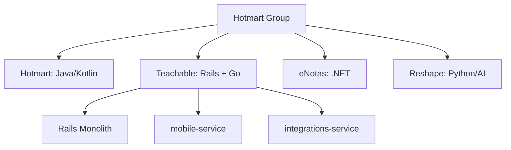
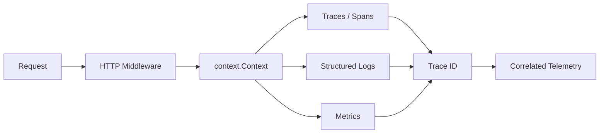
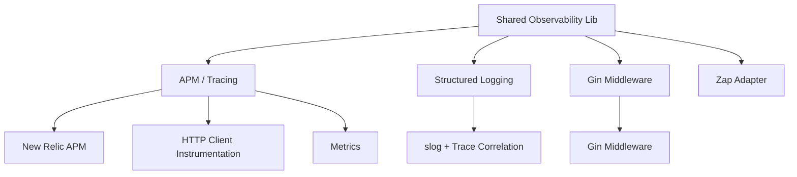
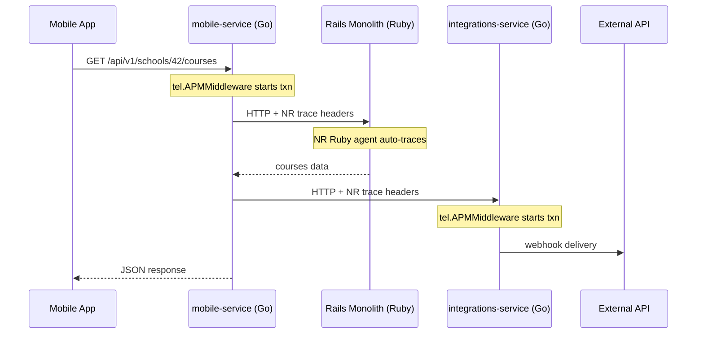

# Architecting Observability in Go

Context Propagation, Structured Logging, and Telemetry Strategy
<!-- <div class="pt-12"> -->
  <span class="opacity-60">
    Gilmar Alcantara - Hotmart
  </span>
<!-- </div> -->


<!--
Observabilidade não é um checkbox de ferramenta - é uma decisão de arquitetura.
Em Go, essa decisão é ainda mais evidente porque nada acontece automaticamente.
-->

---

# About Me

<div class="grid grid-cols-2 gap-8 mt-6">
<div>

**Gilmar Alcantara**

- 🏢 Staff Engineer at **Hotmart**
- 💼 *+10 years* of software engineering experience
- 🐹 Go enthusiast - building microservices at scale
- 🔭 Focused on **observability**, **platform engineering**, and **international regulations**

</div>
<div>

- 🎓 Bachelor of Computer Engineering from **CEFET-MG**
- 🌎 Based in Brazil (Minas Gerais)
- 👨‍👦 Father of **Benjamin** (9 years) and **Levi** (2 months)
- 🎯 Passionate about making the right thing easy for engineering teams
- 🌍 Now working with **international financial regulations** at Hotmart


</div>
</div>


<!--
Me apresentando brevemente antes de entrar no conteúdo técnico.
Formado pelo CEFET-MG, passei por varias outras empresas como a IBM, e hoje atuo no time financeiro da Hotmart com regulamentações internacionais.
-->

---

# About This Talk

Based on a **real-world experience** leading an observability migration at **Hotmart** - a global edtech company that also operates **Teachable**.

<v-clicks>

- **Datadog → New Relic migration** driven by cost reduction (free data quota on NR contract)
- Led the **Go microservices** instrumentation strategy under a tight deadline
- Collaborated on **Ruby and Java** service instrumentation
- Not a vendor comparison - **architectural learnings** and practical decisions
- **Observability is an architectural decision, and in Go, it is explicit by design.**


</v-clicks>

<!--
Essa palestra vem de experiência real. Liderei a frente de instrumentação Go na migração de Datadog para New Relic.
Não é sobre comparar ferramentas - é sobre as decisões arquiteturais que fizemos e por quê.
-->

---
layout: section
---

# The Migration Context

---

# The Landscape



<v-clicks>

- **Hotmart** acquired **Teachable** in 2021
- Hotmart was already using **New Relic** (Java/Kotlin)
- Teachable was on **Datadog** - Rails monolith + Go microservices
- The migration happened only on **Teachable's side** (Ruby + Go)

</v-clicks>

<!--
Hotmart comprou Teachable em 2021. Duas plataformas, stacks diferentes.
Teachable está migrando do monolith Rails para microservices em Go - e a observabilidade precisa cobrir tudo.
-->

---

# Why the Migration Was Hard

<v-clicks>

- **Cost reduction was the primary driver** - free data quota on the New Relic contract eliminated all Datadog costs
- **Tight deadline** - Datadog contract was expiring, no room for extended timelines
- **Different runtimes, different instrumentation models** - auto-agent (Java, Ruby) vs manual (Go)
- **No shared standards** - each service had its own logging format, trace setup
- **Some Go services had zero instrumentation** in some cases - raw `fmt.Println`
- **OpenTelemetry Collector adds too much DevOps effort** - deploying and maintaining a Collector infrastructure was not viable in the limited time window

</v-clicks>

<v-click>

> The deadline pressure is also why we didn't migrate to OpenTelemetry directly - vendor SDK was the fastest path to production with quality.

</v-click>

<!--
O driver principal foi custo: free data quota no contrato NR eliminou todo custo com DD.
Mas o prazo apertado do contrato DD expirando nos forçou a ser pragmáticos - OTel direto era risco demais.

- Fluentd, para to get logs from pods and send to K8s
- Posteriormente também é sabido que poderimos optar por usar os coletores dos parceiros...
-->

---
layout: section
---

# Why Observability in Go is Different

---
layout: two-cols
---

# Automatic vs Manual Instrumentation

**JIT/Interpreted Languages** (Java, Ruby, Node.js)

- Runtime agents intercept calls
- Automatic span creation
- Low initial effort
- **Less control, more noise**

::right::

<div class="mt-22">

**Go (Compiled)**

- Explicit instrumentation in code
- Developer decides span boundaries
- Higher initial effort
- **Full control, clean signals**

</div>

<v-click>

<div class="mt-4 p-3 bg-blue-50 rounded dark:bg-blue-900">
💡 More upfront work, but <strong>significantly better signal-to-noise ratio</strong>.
</div>

</v-click>

<!--
Na migração, os serviços Java e Ruby foram "fáceis" - instala o agent e pronto.
Go exigiu design. Mas o resultado é mais limpo e controlável.

Reflection and 
Java aspects!

Podemos instrumentar caminihos críticos da aplicação e evitar caminhos simples como health checks
Momento do produto
Time mais/menos senior...

-->

---

# How the Three Pillars Connect



<v-clicks>

- **Traces** - show the path of a request across services and measure latency at each hop
- **Logs** - provide detailed event records with business context at each step
- **Metrics** - aggregate numerical data (request count, error rate, latency percentiles)
- The **correlation key** is always the same: **Trace ID** propagated via `context.Context`
- Without correlation, logs are isolated events and metrics are numbers without context

</v-clicks>

<!--
O trace ID é o que conecta tudo. Sem ele, logs são eventos isolados e métricas são números sem contexto.

- Metricas devem ser usadas para alertas, não logs
- Logs devem ser os ultimos analizados em um incidente, 
- O  objeto é encontrar o log!
-->

---
disabled: true
---

# Why Not OpenTelemetry (Yet)?

<v-clicks>

- **Tight deadline** - DD contract expiring, no time for OTel Collector infrastructure setup
- OTel Collector requires **dedicated infrastructure** - CPU, memory, networking, operational expertise
- Adds a **new failure point** in the telemetry pipeline
- New Relic Go agent = **proven, fast to implement**, already covered by the new contract
- OTel is the strategic direction - but **not under deadline pressure**

</v-clicks>

<v-click>

> Pragmatism over idealism: vendor SDK now, abstraction layer for OTel later. Ship fast, migrate cleanly.

</v-click>

<!--
Com o contrato DD vencendo, não tínhamos tempo pra montar infra de Collector.
NR agent era o caminho mais rápido pra produção com qualidade. OTel fica pro futuro.
-->

---
layout: section
---

# Context Propagation

The backbone of distributed tracing in Go

---

# context.Context: The Propagation Vehicle

```go {all|3-4|6-7|9-12|all}
// mobile-service - handler with context propagation
func GetCourses(cfg config.Configs, logger log.Loggable, client tel.HttpClient) http.HandlerFunc {
    return func(w http.ResponseWriter, r *http.Request) {
        ctx := r.Context()

        schoolID := r.PathValue("school_id")
        courses, err := fetchCourses(ctx, client, cfg, schoolID)
        if err != nil {
            logger.ErrorContext(ctx, "failed to fetch courses",
                "school_id", schoolID,
                "error", err,
            )
            http.Error(w, "internal error", http.StatusInternalServerError)
            return
        }

        writeJSON(w, courses)
    }
}
```

<!--
O context carrega trace info, deadlines, e cancellation - tudo junto.
Cada função que recebe ctx participa do trace automaticamente via New Relic.

- Injeção de dependência.
- closures

-->

---

# The Golden Rule of Context in Go

<v-clicks>

1. **Always accept `context.Context` as the first parameter**
2. **Always propagate it downstream** - never discard
4. **Use `context.Background()` only at entry points** (main, init, tests)
3. **Never store context in structs** - it's request-scoped

</v-clicks>

<v-click>

```go
// ✅ Correct - context flows naturally
func (r *Repo) GetUser(ctx context.Context, id string) (*User, error)

// ❌ Wrong - context stored in struct, loses request scope
type Repo struct {
    ctx context.Context  // DON'T DO THIS
}
```

</v-click>

<!--
Contexto em struct é um anti-pattern clássico. Ele é request-scoped - armazená-lo quebra traces.
-->

---
layout: section
---

# Structured Logging with Trace Correlation

---

# From Printf to slog with Trace ID

````md magic-move
```go
// ❌ Unstructured - impossible to query or correlate
log.Printf("order %s processed for user %s", orderID, userID)
```
```go
// ⚠️ Structured but no trace correlation
slog.Info("order processed",
    "order_id", orderID,
    "user_id", userID,
)
```
```go
// ✅ Structured + trace-correlated via context
logger.InfoContext(ctx, "order processed",
    "order_id", orderID,
    "user_id", userID,
)
// trace_id and span_id injected automatically by the log middleware
```
````

<v-click>

The log middleware injects `trace_id` and `span_id` from New Relic - **zero effort at call sites**.

</v-click>

<!--
slog é padrão desde Go 1.21. O tlog.Middleware injeta trace info no log record automaticamente.
-->

---

# How log Middleware Works

```go {all|5-7|9-15|16|all}
// Extracts NR trace info (added by APM Middleware) and injects into slog context
func Middleware(cfg config.Config) func(next http.Handler) http.Handler {
    return func(next http.Handler) http.Handler {
        return http.HandlerFunc(func(w http.ResponseWriter, r *http.Request) {            
            // Extract trace_id and span_id from NR transaction
            ctx := r.Context() // already has NR transaction (from APM Middleware)
            traceID, spanID := tel.TraceFromContext(ctx)

            // Inject into slog context for all downstream logs
            ctx = contextWithFields(ctx,
                slog.String("trace_id", traceID), // to be agnostic!
                slog.String("span_id", spanID), // to be agnostic!
                slog.String("http.method", r.Method),
                slog.String("http.path", r.URL.Path),
            )
            next.ServeHTTP(w, r.WithContext(ctx))
        })
    }
}
```

<v-click>

<div class="mt-4 p-3 bg-blue-50 rounded dark:bg-blue-900">
💡 The APM Middleware already adds trace_id/span_id to context. Here we're just <strong>reading</strong> them and adding extra context (method, path) for structured logging.
</div>

</v-click>

<!--
O middleware injeta trace context UMA VEZ - todas as chamadas logger.*Context(ctx, ...) herdam isso.
Quem coloca o trace no context é o APM Middleware (New Relic). Esse middleware apenas lê e enriquece o slog.
Não exquecer que esse contexto que estamos enriquecendo é enviado nas chamadas do slog.
-->

---

# Custom slog Handler - Extracting Context

```go {all|1-4|5-7|8-10|11-15|16-18|all}
type appLoggerHandler struct {
    slog.Handler
    fixedAttributes []slog.Attr
}
func NewHandler(handler slog.Handler, attrs ...slog.Attr) *appLoggerHandler {
    return &appLoggerHandler{handler, attrs}
}
func (h appLoggerHandler) Handle(ctx context.Context, r slog.Record) error {
    // Fixed attributes (app_name, env, pod_name)
    r.AddAttrs(h.fixedAttributes...)
    // Trace correlation from NR transaction
    if info, ok := telemetry.TraceFromContext(ctx); ok {
        r.Add(slog.String("trace.id", info.TraceId))
        r.Add(slog.String("span.id", info.SpanId))
    }
    // HTTP request info, account, custom fields from context...
    return h.Handler.Handle(ctx, r)
}
```

<v-click>

<div class="mt-4 p-3 bg-blue-50 rounded dark:bg-blue-900">
💡 The custom handler bridges context and slog - every <code>logger.InfoContext(ctx, ...)</code> call automatically includes trace_id, span_id, and all enriched fields without the caller needing to pass them explicitly.
</div>

</v-click>

<!--
Esse é o "truque" da nossa lib: um handler customizado que pega tudo do context e injeta no record.
O desenvolvedor só precisa passar ctx - o handler faz o resto.
-->

---

# Inside Initialize - Enforcing the Standard

```go {all|3-7|8|9-10|11|12-14|all}
func Setup(cfg config.Config) (*slog.Logger, error) {
    // ...
    fixedAttributes := []slog.Attr{
        slog.String("app_name", cfg.ServiceName),
        slog.String("app_version", cfg.Version),
        slog.String("env", cfg.AppEnv),
    }
    var appHandler *appLoggerHandler
    // NR agent available → JSON + trace correlation
    nrHandler := nrslog.JSONHandler(telemetry.App, cfg.LogOutput, &options)
    appHandler = NewHandler(nrHandler, fixedAttributes...)
    logger := slog.New(appHandler)
    slog.SetDefault(logger) // Third-party code also gets the standard
    return logger, nil
}
```

<v-clicks>

- **Fixed attributes** → every log has `app_name`, `env`, `pod_name` automatically
- **`NewHandler`** → wraps inner handler with our custom `appLoggerHandler`
- **`slog.SetDefault`** → even third-party libs follow the same standard

</v-clicks>

<!--
Esse é o coração do padrão: a inicialização garante que NENHUM log sai sem app_name, env, pod_name.
slog.SetDefault faz com que até código de terceiros (libs) use o mesmo handler.
nrslog.JSONHandler injeta trace_id/span_id automaticamente quando NR agent está ativo.
-->

---

# Correlated JSON Output

```json {all|6-7|8-10|11-12|all}
{
  "time": "2025-03-15T10:23:45.123Z",
  "level": "INFO",
  "msg": "courses fetched",
  "service": "mobile-service",
  "trace_id": "4bf92f3577b34da6a3ce929d0e0e4736",
  "span_id": "00f067aa0ba902b7",
  "school_id": "42",
  "http.method": "GET",
  "http.path": "/api/v1/schools/42/courses",
  "mobile.device_os": "iOS",
  "mobile.app_version": "3.2.1",
}
```

<v-click>

**Jump from log → trace** in New Relic. Filter by trace_id for full request lifecycle. Correlate mobile device context with backend errors.

</v-click>

<!--
O additionalLogHeaderData injeta contexto mobile - invaluável para debugging por device.
-->

---

# Logger in Context vs Values in Context

````md magic-move
```go
// ❌ Common pattern (zerolog, logrus): store logger instance in context
func Middleware(next http.Handler) http.Handler {
    return http.HandlerFunc(func(w http.ResponseWriter, r *http.Request) {
        logger := zerolog.Ctx(r.Context()).With().
            Str("trace_id", traceID).
            Str("http.method", r.Method).Logger()
        ctx := logger.WithContext(r.Context()) // logger IN context
        next.ServeHTTP(w, r.WithContext(ctx))
    })
}
// Usage: zerolog.Ctx(ctx).Info().Msg("order processed")
```
```go
// ✅ Our approach: store values in context, handler reads them
func Middleware(next http.Handler) http.Handler {
    return http.HandlerFunc(func(w http.ResponseWriter, r *http.Request) {
        ctx := contextWithFields(r.Context(),
            slog.String("trace_id", traceID),
            slog.String("http.method", r.Method),
        ) // values IN context, not a logger
        next.ServeHTTP(w, r.WithContext(ctx))
    })
}
// Usage: logger.InfoContext(ctx, "order processed")
```
````

<v-clicks>

- Logger in context = coupled to a specific lib (zerolog, logrus)
- Values in context = any handler/lib can read them (slog, NR, custom)
- **Performance** - context values are lightweight; a logger instance carries buffers, formatters, writers
- **Hidden dependency** - `zerolog.Ctx(ctx)` hides a concrete logger behind context; hard to trace in code review
- **Request-scoped** - values naturally match request lifecycle; a logger instance may carry state across boundaries

</v-clicks>

<!--
Colocar o logger no context é o padrão mais comum, especialmente com zerolog.
Mas acopla o código inteiro a uma lib específica.
Valores no context são mais flexíveis - qualquer handler pode ler e usar.
-->

---
layout: section
---

# The Shared Telemetry Library

Centralizing observability for Go microservices

---

# Architecture: Shared Telemetry Library



<v-click>

- One library. 
- One `Initialize()` call. 
- Every service starts from the same baseline.

</v-click>

<!--
A lib nasceu dessa migração. Em vez de cada serviço fazer sua instrumentação, centralizamos tudo.

- Arquitetura de referencia: http mux (go 1.21) e slog
- Suport a  gin e zap....

factoru de controllers
-->

---

# Bootstrapping Telemetry

```go {all|1-5|7-12|all}
// cmd/api/main.go - mobile-service (Go 1.22+, http.ServeMux, slog)
func main() {
    cfg := config.NewConfig()
    ctx := context.Background()

    // One call: configures New Relic + slog + trace correlation
    logInstance, err := tel.Initialize(
        tel.WithServiceName(cfg.AppName),
        tel.WithLogLevel(cfg.LogLevel),
        tel.WithEnv(cfg.AppEnv),
        tel.WithVersion(cfg.DevopsCommit),
    )
    if err != nil {
        panic(err)
    }

    logger := log.New(logInstance)
    nrApp := tel.NRApp
    defer nrApp.Shutdown(8 * time.Second)
    // ... db, feature flags, http client, server setup
}
```

<!--
Uma única chamada configura New Relic + slog + trace correlation.
Functional options permitem flexibilidade sem quebrar a interface.
-->

---
layout: section
---

# HTTP Middleware Patterns

Consistent instrumentation at the edge

---

# HTTP Middleware - Where Instrumentation Lives

```go {all|3-5|9-10|all}
func main() {
    mux := http.NewServeMux()
    // Public - no instrumentation needed
    mux.HandleFunc("GET /__healthcheck__", controllers.Health)

    // Protected - wrap with observability middlewares
    handler := controllers.GetCourses(cfg, logger, httpClient)
    mux.Handle("GET /api/v1/schools/{school_id}/courses",
        tel.APMMiddleware(          // 1. starts NR transaction
        tlog.Middleware(            // 2. structured logging + trace correlation
        auth.Middleware(            // 3. authentication
            handler,
        ))),
    )
}
```

<v-clicks>

- **Order matters** - APM first so the transaction exists when log middleware runs
- Health checks stay outside - no need to trace or log them
- Each middleware is just `func(http.Handler) http.Handler`

</v-clicks>

<!--
A ordem importa: APM middleware vem primeiro para que o transaction exista quando o log middleware executa.
Tomar cuidado para não instrumentar healthchecks e endpoints triviais.
Para casos de sucesso a métrica resolve o alerta - não precisa logar tudo.
-->

---
layout: section
---

# Enriching Telemetry

---
disabled: true
---

# Business Context in Traces

```go {all|3-5|7-12|all}
// Enrich NR transaction with business dimensions
func newRelicExtraDataMiddleware(next http.Handler) http.Handler {
    return http.HandlerFunc(func(w http.ResponseWriter, r *http.Request) {
        acc, _ := models.AccountFromContext(r.Context())
        txn := newrelic.FromContext(r.Context())

        if txn != nil {
            txn.AddAttribute("teachableAccount", acc.Id)
            txn.AddAttribute("userId", acc.UserId)
            txn.AddAttribute("schoolId", acc.SchoolId)
            for desc, headerKey := range additionalHeaderData {
                txn.AddAttribute(desc, r.Header.Get(headerKey))
            }
        }
        next.ServeHTTP(w, r)
    })
}
```

<v-click>

Query traces by **business dimensions** - school, user, device - not just HTTP status codes.

</v-click>

<!--
"Mostra requests do school 42 com app version < 3.0" - agora é possível.
-->

---

# Manual Instrumentation - DB & HTTP

```go {all|1-6|8-13|all}
// Database - using nrpgx driver for automatic query tracing
db, _ := sql.Open("nrpgx",
    "host=localhost port=5432 user=postgres dbname=postgres sslmode=disable",
)
// Every query with context will generate a Datastore segment in NR
row := db.QueryRowContext(ctx, "SELECT count(*) FROM orders WHERE school_id = $1", schoolID)

// HTTP Client - wrap with newrelic round tripper
client := &http.Client{
    Transport: newrelic.NewRoundTripper(http.DefaultTransport),
}
req, _ := http.NewRequestWithContext(ctx, "GET", url, nil)
resp, _ := client.Do(req) // Creates External segment + propagates trace headers

```

<v-click>

<div class="mt-4 p-3 bg-blue-50 rounded dark:bg-blue-900">
💡 The key pattern: pass <code>context.Context</code> with the NR transaction to every integration - the SDK handles segment creation automatically.
</div>

</v-click>

<!--
Cada integração tem seu wrapper NR: nrpgx para Postgres, NewRoundTripper para HTTP, StartTransaction para SQS.
O padrão é sempre o mesmo: ctx com transação → segmento automático.
-->

---

# Custom Metrics and Async Flows

```go {all|1-5|7-13|all}
// Custom business metrics - alert on what matters
tel.RecordMetric("Custom/CoursesLoaded", float64(len(courses)))
tel.IncrementMetric("Custom/API/Schools/Requests")
// Use metrics for alerts, not logs!
// "Error rate > 5% on school 42" is actionable. Grepping logs is not.

// SQS Consumer - treat messages like HTTP requests
func (w *Worker) ProcessMessage(msg *sqs.Message) {
    // Start a transaction manually - this is the "entry point"
    txn := nrApp.StartTransaction("SQS/ProcessPurchase")
    defer txn.End()
    ctx := newrelic.NewContext(context.Background(), txn)

    // From here, all downstream calls (DB, HTTP) are traced
    order, err := w.repo.GetOrder(ctx, msg.OrderID)
    w.notifier.Send(ctx, order)
}
```

<v-clicks>

- **HTTP handlers** get transactions from middleware automatically
- **Async workers** (SQS, Kafka, cron) need `StartTransaction` manually
- Think of it as: the message arrival **is** the request

</v-clicks>

<!--
Listeners são como controllers - a chegada de uma mensagem é como uma request HTTP.
Sem StartTransaction, SQS consumers seriam invisíveis no tracing.
Métricas são para alertas. Logs são o último recurso na investigação.
-->


---
layout: section
---

# Multi-Runtime Challenges

---

# The Polyglot Reality

| Aspect | Go (shared lib) | Ruby (NR agent) | Java (NR agent) |
|--------|-----------|-----------------|-----------------|
| Instrumentation | Manual via library | Automatic agent | Automatic agent |
| Trace propagation | Explicit via `ctx` | Agent handles | Agent handles |
| Log correlation | Log middleware injects trace_id | Agent injects | Agent injects |
| Migration effort | **High** (build library) | Low (swap agent) | Low (swap agent) |
| Signal quality | High (intentional) | Variable (noisy) | Variable (noisy) |

<v-click>

**Key insight**: Go required the most effort but produced the **cleanest signals**. The investment paid off.

</v-click>

<!--
Ruby e Java: swap de agent, reinicia, done. Go exigiu criar a lib inteira.
Mas o resultado em Go é muito mais limpo.
-->

---
disabled: true
---

# Cross-Service Trace Flow



<!--
O trace completo aparece no New Relic - Go, Ruby, externo - tudo conectado.
-->

---
layout: section
---

# Governance & Sustainability

---

# The Instrumentation Contract

<v-clicks>

- **Every HTTP server** → `tel.APMMiddleware` + `tlog.Middleware`
- **Every HTTP client** → `tel.NewHttpClient()` for auto span propagation
- **Every log line** → `logger.*Context(ctx, ...)` - never `fmt.Println`
- **Every service** → `tel.Initialize(...)` at startup
- **Always pass `context.Context`** explicitly - especially to external calls

</v-clicks>

<v-click>

> Any engineer can look at any service's telemetry and **immediately understand it** - same structure, same semantics.

</v-click>

<!--
Padronização é o que transforma observabilidade de ferramenta em plataforma.
-->

---

# Next Steps - The Future

<v-clicks>

- **Third-party vendors now provide managed OTel Collectors** - no need to deploy and maintain our own
- **We already proved this works** - eNotas (.NET/C#) is sending telemetry via vendor-managed OTel Collector
- **`go-easy-instrumentation`** - New Relic's tool that suggests instrumentation changes to Go source code automatically
- **Alibaba + Datadog → OTel SIG** - Datadog's Orchestrion (compile-time instrumentation via `-toolexec`) was donated to OpenTelemetry, creating a vendor-neutral standard
- **OTel Compile-Time Instrumentation (`otelc`)** - the result of that initiative; uses Go's `-toolexec` build flag to inject tracing at compilation, zero source code changes (v1 released July 2026)

</v-clicks>

<v-click>

```bash
# OTel compile-time instrumentation - just change how you build
go build -toolexec otelc ./cmd/api
# Same source code, instrumented binary. No manual spans needed.
```

</v-click>

<!--
Orchestrion da Datadog foi o precursor - compile-time instrumentation usando -toolexec do Go.
Em 2025, Alibaba e Datadog doaram seus engines para a OTel, formando a Go Compile-Time Instrumentation SIG.
O resultado é o otelc - vendor neutral, v1 lançado em julho 2026.
Já fizemos OTel com eNotas em C#. Go é o próximo passo.
go-easy-instrumentation sugere mudanças no código fonte automaticamente (diff-based, mais simples).
-->

---

# AI Agents & Observability

<v-clicks>

- AI skills connected to your observability provider (New Relic, Datadog, etc.) can analyze logs, metrics, and traces automatically
- But they only work well if your data is **structured and correlated**
- `fmt.Println` is a dead end for any agent - structured JSON logs are machine-readable
- Consistent field names (`app_name`, `school_id`, `trace_id`) make search and reasoning possible
- The investment in good instrumentation pays double - humans AND AI agents benefit

</v-clicks>

<v-click>

> Good instrumentation is like writing a good prompt - the clearer the context, the better the answer.

</v-click>

<!--
Experiência real usando AI agent do New Relic.
Basicamente é um prompt bem feito - se seus dados são limpos, o agente consegue navegar.
Se seus logs são fmt.Println, nenhum agente vai te ajudar.
-->

---
disabled: true
---

# Lessons Learned

<v-clicks>

1. **Migrations are opportunities** - don't just swap SDKs, redesign the approach

2. **Go requires upfront investment** - but returns compound interest in signal quality

3. **A shared library is non-negotiable** - without it, every team reinvents instrumentation

4. **Make the right thing easy** - not the wrong thing impossible

5. **Polyglot environments need a common contract** - trace headers are the universal language

6. **Prefer `slog`** - it's standard, fast, and integrates with everything

</v-clicks>

<!--
Esses são os aprendizados reais da migração. Cada um veio de um problema concreto.
-->

---
layout: center
---

# Key Takeaways

<v-clicks>

- Pass `context.Context` everywhere - it's how traces, logs, and metrics connect
- Instrument at the edges (middleware/clients) - it covers 80% of what you need
- Build a shared library - don't let each team reinvent instrumentation (otel?)
- Good observability today = better AI/human debugging tomorrow
- **Go's explicitness is a feature - intentional signals > automatic noise**

</v-clicks>

<!--
Resumo prático: contexto, middleware, biblioteca compartilhada, pragmatismo.
Go te força a ser explícito - e isso é uma vantagem.
-->

---
layout: center
class: text-center
---

# Thank You

Observability in Go is engineering - explicit, intentional, and architecturally sound.

<div class="text-sm opacity-60 mt-4">
  Gilmar Alcantara - Hotmart
</div>

<!--
Observabilidade não é sobre ferramentas - é sobre decisões de design.
- explicito
- intencianak
- arquitetonicamente sólido
-->

---
layout: end
disabled: true
---

<div class="absolute top-10 left-0 right-0 text-center z-20">
  <h1 class="text-4xl font-bold text-white">Thank You</h1>
  <p class="text-base opacity-80 mt-3">Observability in Go is engineering - explicit, intentional, and architecturally sound.</p>
  <p class="text-sm opacity-60 mt-2">Gilmar Alcantara - Hotmart</p>
</div>

<!--
GopherCon LATAM 2026
-->
